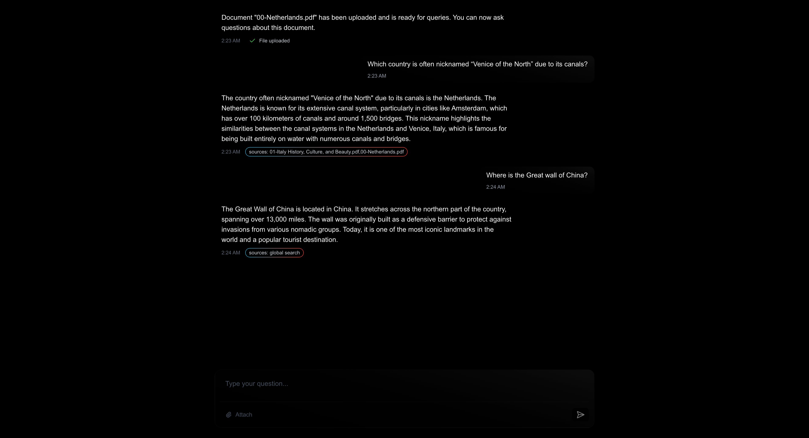

# RAG with FastAPI & LangChain

A modern document Q&A system built with FastAPI, LangChain, and Next.js that allows users to upload documents and ask questions about their content using Retrieval-Augmented Generation (RAG).

## 🚀 Features

- **Document Upload**: Support for PDF and TXT files
- **Smart Search**: Document-specific search with global fallback capabilities
- **Real-time Streaming**: Server-Sent Events for live query responses
- **Contextual Compression**: Automatic result sanitization and deduplication
- **Modern UI**: Beautiful, responsive interface built with Next.js and Tailwind CSS
- **Vector Database**: ChromaDB for efficient document storage and retrieval
- **OpenAI Integration**: Human-readable answer formatting

## 📸 Screenshots



## 🎥 Demo Video

[Watch Demo](assets/recording.mov)

## 🏗️ Architecture

- **Backend**: FastAPI with LangChain for RAG implementation
- **Frontend**: Next.js 15 with TypeScript and Tailwind CSS
- **Vector Database**: ChromaDB for document embeddings
- **AI Provider**: OpenAI for text generation and embeddings

## 📋 Prerequisites

- Python 3.8+
- Node.js 18+
- Docker and Docker Compose
- OpenAI API key

## 🛠️ Installation & Setup

### 1. Clone the Repository

```bash
git clone <your-repo-url>
cd ask-docs
```

### 2. Start ChromaDB

First, start the ChromaDB vector database using Docker:

```bash
cd server
docker-compose up -d
```

This will start ChromaDB on port 8001.

### 3. Set Up the Backend

```bash
cd server
pip install -r requirements.txt
```

Create a `.env` file in the server directory:

```bash
OPENAI_API_KEY=your_openai_api_key_here
```

### 4. Set Up the Frontend

```bash
cd client
npm install
```

## 🚀 Running the Application

### 1. Start the Server

```bash
cd server
python main.py
```

The FastAPI server will start on `http://localhost:8000`

### 2. Start the Client

```bash
cd client
npm run dev
```

The Next.js application will start on `http://localhost:3000`

## 🔧 API Endpoints

- `POST /api/documents/upload` - Upload a document
- `POST /api/documents/query` - Query documents
- `POST /api/documents/query/stream` - Stream query responses
- `GET /api/documents/stats` - Get document statistics
- `GET /api/documents/health` - Health check
- `GET /docs` - API documentation (Swagger UI)

## 🏃‍♂️ Quick Start

1. **Start ChromaDB**: `docker-compose up -d`
2. **Start Server**: `python main.py` (from server directory)
3. **Start Client**: `npm run dev` (from client directory)
4. **Open Browser**: Navigate to `http://localhost:3000`
5. **Upload Document**: Click the upload button and select a PDF or TXT file
6. **Ask Questions**: Start asking questions about your uploaded document!

## 🛠️ Development

### Backend Development

The backend is built with FastAPI and includes:
- Document processing with LangChain
- Vector embeddings with OpenAI
- ChromaDB integration for document storage
- Streaming responses with Server-Sent Events

### Frontend Development

The frontend is built with Next.js 15 and includes:
- Modern React with TypeScript
- Tailwind CSS for styling
- Real-time chat interface
- File upload functionality
- Responsive design

## 📁 Project Structure

```
ask-docs/
├── client/                 # Next.js frontend
│   ├── src/app/           # App router components
│   ├── public/            # Static assets
│   └── package.json       # Frontend dependencies
├── server/                # FastAPI backend
│   ├── controller/        # API controllers
│   ├── service/           # Business logic
│   ├── config/            # Configuration files
│   ├── main.py           # FastAPI application
│   └── requirements.txt   # Python dependencies
├── assets/               # Media files
│   ├── photo.png         # Screenshot
│   └── recording.mov     # Demo video
└── README.md             # This file
```

## 🤝 Contributing

1. Fork the repository
2. Create a feature branch
3. Make your changes
4. Add tests if applicable
5. Submit a pull request

## 📄 License

This project is created for **learning purposes** and is open source. Feel free to use, modify, and learn from this code for educational purposes.

**Note**: This is a learning project demonstrating RAG (Retrieval-Augmented Generation) implementation with FastAPI, LangChain, and Next.js. The code is provided as-is for educational use.

## 🙏 Acknowledgments

- [LangChain](https://langchain.com/) for RAG implementation
- [FastAPI](https://fastapi.tiangolo.com/) for the backend framework
- [Next.js](https://nextjs.org/) for the frontend framework
- [ChromaDB](https://www.trychroma.com/) for vector storage
- [OpenAI](https://openai.com/) for AI capabilities
